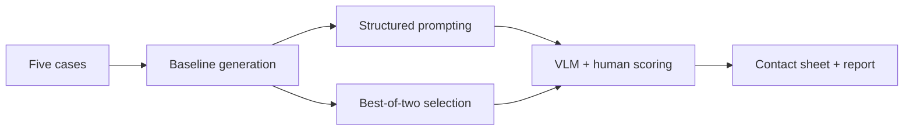

# Garment-consistency experiment plan

**Summary:** Build the smallest runnable experiment that compares a direct baseline with two practical garment-consistency strategies, then present visual and measured results.

## Milestones

1. **Experiment foundation**
   - Load three development and two holdout cases.
   - Render one baseline prompt.
   - Send one mocked OpenRouter Images API request and persist compact metadata.
   - Configure tests, linting, typing, building, and CI.

2. **Baseline evidence**
   - Run one development case first and inspect it.
   - Compare Seedream and Gemini on D01-D03.
   - Select one generator based on garment fidelity, cost, and latency.

3. **Improvement strategies**
   - Add structured garment-attribute prompting.
   - Add best-of-two generation with VLM selection.

4. **Evaluation and communication**
   - Score visible garment attributes with a VLM and manual sanity check.
   - Produce a comparison table and contact sheet.
   - Write a short report covering failures, results, costs, and next steps.

## Constraints

- No fine-tuning, UI, deployment, production orchestration, or large benchmark.
- Never commit input images, outputs, or API keys.
- Do not inspect holdout results until the strategy and rubric are fixed.
- No automatic retry of paid requests.
- Record the prompt, references, model, strategy, and API-reported cost for every output.
