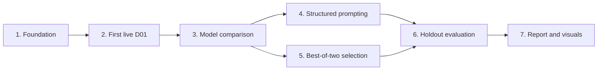

# Garment-consistency experiment plan

**Summary:** Build the smallest runnable experiment that compares a direct baseline with two practical garment-consistency strategies, then present visual and measured results.

## Milestones

1. **Experiment foundation**
   - Load three development and two holdout cases.
   - Render one baseline prompt.
   - Send one mocked OpenRouter Images API request and persist compact metadata.
   - Configure tests, linting, typing, building, and CI.

2. **Baseline evidence**
   - Run one development case first and inspect it.
   - Compare Seedream and Gemini on D01-D03.
   - Select one generator based on garment fidelity, cost, and latency.

3. **Improvement strategies**
   - Add structured garment-attribute prompting.
   - Add best-of-two generation with VLM selection.

4. **Evaluation and communication**
   - Score visible garment attributes with a VLM and manual sanity check.
   - Produce a comparison table and contact sheet.
   - Write a short report covering failures, results, costs, and next steps.

## Execution slices

Each slice is one reviewable change with a concrete output and a decision gate before the next slice begins.

### 1. Experiment foundation

**Output:** Case loading, baseline prompt rendering, mocked OpenRouter request handling, compact output persistence, tests, packaging, and CI.

**Decision gate:** The offline workflow is runnable and all validation gates pass.

### 2. First live D01 baseline

**Output:** One Seedream generation for D01 with its image and metadata inspected manually.

**Decision gate:** The request works mechanically, the references are interpreted in the expected roles, and the saved metadata is sufficient to reproduce the call.

### 3. Baseline model comparison

**Output:** Seedream and Gemini outputs for D01-D03, with six images compared on garment fidelity, cost, and latency.

**Decision gate:** Select one generator and stop comparing models.

### 4. Structured prompting

**Output:** Visible garment attributes and a structured prompt applied to the development cases, compared directly with their baselines.

**Decision gate:** Determine whether explicit garment attributes materially improve consistency without an extra generation call.

### 5. Best-of-two selection

**Output:** Two candidates per development case, a VLM selection for each pair, and a manual check of whether the VLM chose correctly.

**Decision gate:** Determine whether the extra generation call produces enough improvement to justify its cost and latency.

### 6. Holdout evaluation

**Output:** Frozen model, prompts, strategy, and rubric applied once to H01-H02, followed by attribute-level VLM and human scores in `results.csv`.

**Decision gate:** Freeze the reported results. Do not tune from holdout failures.

### 7. Submission package

**Output:** Contact sheet, failure-mode taxonomy, cost and latency summary, short `REPORT.md`, and final reproduction instructions in the README.

**Decision gate:** The repository and report can be reviewed in roughly ten minutes and the visual evidence supports every major conclusion.

### Milestone mapping

- Milestone 1: slice 1
- Milestone 2: slices 2-3
- Milestone 3: slices 4-5
- Milestone 4: slices 6-7

## Constraints

- No fine-tuning, UI, deployment, production orchestration, or large benchmark.
- Never commit input images, outputs, or API keys.
- Do not inspect holdout results until the strategy and rubric are fixed.
- No automatic retry of paid requests.
- Record the prompt, references, model, strategy, and API-reported cost for every output.
