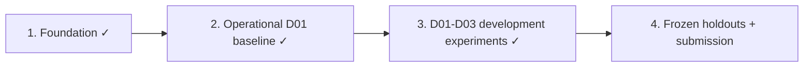

# Garment-consistency experiment plan

**Summary:** Finish the assignment as a small evidence-driven experiment rather than a production platform. Slices 1–3 are complete. Slice 4 applies the frozen baseline to holdouts once and packages the submission.

```mermaid
flowchart LR
    S1[1. Foundation ✓] --> S2[2. Operational D01 baseline ✓]
    S2 --> S3[3. D01-D03 development experiments ✓]
    S3 --> S4[4. Frozen holdouts + submission]
```

## Slice 1 — experiment foundation

**Status:** complete.

**Output:** Case loading, prompt rendering, mocked OpenRouter boundary, metadata persistence, packaging, tests, and free CI.

**Decision gate:** The offline workflow is runnable and validation passes.

## Slice 2 — operational D01 baseline

**Status:** complete.

**Output:** Guarded paid workflow, compact reference preprocessing, one successful Nano Banana 2 Lite D01 baseline, exact cost/latency evidence, and manual garment inspection.

**Recorded decision:** Keep `google/gemini-3.1-flash-lite-image` as the operational generator. Seedream's failed long-running requests are sufficient operational evidence; do not spend more time on a second-generator comparison.

## Slice 3 — consolidated development experiments

**Status:** complete.

**Cases:** D01, D02, D03 only.

**Compared strategies:**

1. `baseline` — one direct generation.
2. `structured` — visible garment attributes extracted from the packshot and injected as hard prompt constraints; candidate A is the standalone structured result.
3. `best_of_two` — structured candidates A and B, scored through opaque candidate IDs; select the higher mean score, breaking ties toward A.

**Execution:** 9 image generations, 3 attribute-extraction VLM requests, 3 initial comparison requests, 3 blinded rescore requests, 0 holdout requests, and 0 automatic retries. The blinded rescore reused the original generated images.

**Result:** Blinded automatic means tied at `0.8889` for baseline, structured, and best-of-two. Manual means were baseline `0.6833`, structured `0.6500`, and best-of-two `0.6500`. Corrected average end-to-end method cost/latency was baseline `$0.034466 / 5.48 s`, structured `$0.035331 / 8.16 s`, and best-of-two `$0.072624 / 54.89 s`. Best-of-two also disagreed with human preference on D03.

**Recorded decision:** Freeze `baseline` for slice 4 using `google/gemini-3.1-flash-lite-image`, `prompts/baseline.txt`, one `1K`/`3:4` candidate, existing compact preprocessing, and no resampling. Use `openai/gpt-4.1-mini` only for rough scoring, blind treatment identity in any comparison, enforce one source-level N/A mask, and retain the manual rubric as the final check.

## Slice 4 — frozen holdouts and submission

**Status:** next.

**Output:** Apply the frozen baseline once to H01 and H02; complete automatic and manual checks; produce final comparison visuals, failure taxonomy, cost/latency summary, `REPORT.md`, and reproduction instructions.

**Decision gate:** Freeze reported results without tuning from holdout failures. The repository and report should be understandable in roughly ten minutes.

## Constraints

- No fine-tuning, UI, deployment, database, dashboard, generalized benchmark framework, or production orchestration.
- Never commit API keys, input images, or generated images.
- Paid workflows are manual/reusable only and have no automatic retry.
- Keep generated outputs in short-lived GitHub artifacts; commit only compact evidence and decisions.
- H01 and H02 remained ungenerated and uninspected until the slice-3 winner was committed.
