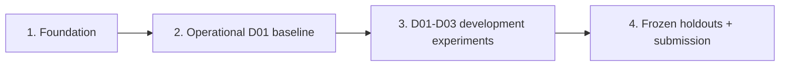

# Garment-consistency experiment plan

**Summary:** Finish the assignment as a small evidence-driven experiment rather than a production platform. Slices 1 and 2 established the runner and operational baseline. Slice 3 consolidates all development experimentation. Slice 4 freezes the winner, evaluates holdouts once, and packages the submission.

```mermaid
flowchart LR
    S1[1. Foundation] --> S2[2. Operational D01 baseline]
    S2 --> S3[3. D01-D03 development experiments]
    S3 --> S4[4. Frozen holdouts + submission]
```

## Slice 1 — experiment foundation

**Status:** complete.

**Output:** Case loading, prompt rendering, mocked OpenRouter boundary, metadata persistence, packaging, tests, and free CI.

**Decision gate:** The offline workflow is runnable and validation passes.

## Slice 2 — operational D01 baseline

**Status:** complete.

**Output:** Guarded paid workflow, compact reference preprocessing, one successful Nano Banana 2 Lite D01 baseline, exact cost/latency evidence, and manual garment inspection.

**Decision gate:** OpenRouter, reference roles, persistence, and artifact inspection work end to end.

**Recorded decision:** Keep `google/gemini-3.1-flash-lite-image` as the operational generator. Seedream's failed long-running requests are sufficient operational evidence; do not spend more time on a second-generator comparison.

## Slice 3 — consolidated development experiments

**Status:** in progress.

**Cases:** D01, D02, D03 only.

**Strategies:**

1. `baseline` — one direct generation.
2. `structured` — visible garment attributes extracted from the packshot and injected as hard prompt constraints; candidate A is the standalone structured result.
3. `best_of_two` — structured candidates A and B, scored by one fixed VLM; select the higher mean score, breaking ties toward A.

**Fixed rubric:** color, print/logo, silhouette/length, construction details, texture/material, and garment presence. Scores are `1`, `0.5`, `0`, or `-1` for genuinely not applicable.

**Paid call budget:**

- 9 image generations: three per development case.
- 3 garment-attribute VLM requests.
- 3 comparison/selection VLM requests.
- 0 holdout requests.
- 0 automatic retries.

**Output:** Generated artifacts and metadata, per-case attribute extraction, VLM scores, deterministic selections, `results.csv`, `manual_scores.csv`, contact sheets, aggregate cost/latency, manual sanity check, and a frozen winner decision.

**Decision gate:** Select exactly one strategy for slice 4 based on automatic scores, manual visual review, cost, latency, and robustness. Do not inspect holdouts before this decision is recorded.

## Slice 4 — frozen holdouts and submission

**Status:** pending.

**Output:** Apply the frozen generator, prompt, strategy, preprocessing, and rubric once to H01 and H02; complete manual checks; produce final comparison visuals, failure taxonomy, cost/latency summary, `REPORT.md`, and reproduction instructions.

**Decision gate:** Freeze reported results without tuning from holdout failures. The repository and report should be understandable in roughly ten minutes.

## Constraints

- No fine-tuning, UI, deployment, database, dashboard, generalized benchmark framework, or production orchestration.
- Never commit API keys, input images, or generated images.
- Paid workflows are manual/reusable only and have no automatic retry.
- Keep generated outputs in short-lived GitHub artifacts; commit only compact evidence and decisions.
- Do not inspect H01 or H02 until slice 3 has a frozen winner and rubric.
