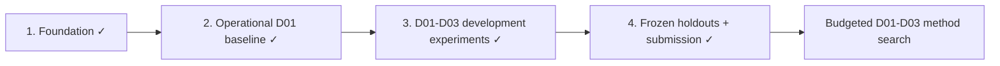

# Garment-consistency experiment plan

**Summary:** The four-slice assignment is complete. A post-submission development-only extension now tests additional methods under a frozen evaluator and a hard OpenRouter allowance floor.

```mermaid
flowchart LR
    S1[1. Foundation ✓] --> S2[2. Operational D01 baseline ✓]
    S2 --> S3[3. D01-D03 development experiments ✓]
    S3 --> S4[4. Frozen holdouts + submission ✓]
    S4 --> E[Budgeted D01-D03 method search]
```

## Slice 1 — experiment foundation

**Status:** complete.

**Output:** Case loading, prompt rendering, mocked OpenRouter boundary, metadata persistence, packaging, tests, and free CI.

## Slice 2 — operational D01 baseline

**Status:** complete.

**Output:** Guarded paid workflow, compact reference preprocessing, one successful Nano Banana 2 Lite D01 baseline, exact cost/latency evidence, and ChatGPT visual inspection.

**Decision:** Keep `google/gemini-3.1-flash-lite-image` as the operational generator. Seedream's failed long-running requests were sufficient operational evidence.

## Slice 3 — consolidated development experiments

**Status:** complete.

**Cases:** D01, D02, D03 only.

**Compared strategies:** direct baseline, structured garment prompting, and best-of-two VLM selection.

**Result:** Blinded automatic means tied at `0.8889`. ChatGPT visual-assessment means were baseline `0.6833`, structured `0.6500`, and best-of-two `0.6500`. Average end-to-end method cost/latency was baseline `$0.034466 / 5.48 s`, structured `$0.035331 / 8.16 s`, and best-of-two `$0.072624 / 54.89 s`.

**Decision:** Freeze the direct baseline: one `1K`, `3:4` candidate, existing preprocessing, no resampling, and ChatGPT visual assessment alongside rough VLM scoring.

## Slice 4 — frozen holdouts and submission

**Status:** complete.

**Execution:** H01 and H02 were generated once with the frozen baseline. The successful workflow made two image requests, two evaluator requests, zero development requests, and zero retries.

**Result:** H01's automatic result is invalid because the evaluator used `-1` for applicable shoe silhouette; H02's valid automatic score is `1.0000`. No two-case automatic mean is reported. The ChatGPT visual-assessment mean is `0.6667`. Total generation cost was `$0.06940025`, rough evaluation cost was `$0.0026784`, and generation latency was `13.1647 s`.

**Output:** Corrected automatic/ChatGPT visual-assessment CSV evidence, crop-enhanced holdout contact sheets with recorded coordinates, failure taxonomy, cost/latency summary, reproduction guide, and `REPORT.md`.

**Decision:** Freeze outputs and ChatGPT visual judgments exactly as observed. No holdout-driven prompt, model, preprocessing, candidate, rubric, regeneration, or ChatGPT visual-score change was performed; only the invalid automatic aggregation and durable presentation evidence were corrected during review.

## Budgeted development-only method search

**Status:** implementation complete; paid execution pending exact-head validation.

**Cases:** D01, D02, D03 only. H01 and H02 are inaccessible.

**Methods:** direct generation, identity-priority prompting, deterministic garment-detail boards, fixed two-pass repair, and predeclared model swaps.

**Evaluation integrity:** `openai/gpt-4.1-mini`, one opaque candidate, the same six-dimension rubric, fixed source-level applicability masks, raw JSON before validation, and no evaluator-based sample selection. The evaluator contract and method queue were committed before execution.

**Budget control:** read key-specific allowance before every paid call, retain a hard `$10.00` floor using conservative per-call reserves, count failed attempts, disable a generation method after its first provider failure, and reserve the near-floor descent for the previously measured low-cost direct Nano Banana 2 Lite method.

**Output:** temporary full artifact plus durable compact result summary after execution. The search does not replace or retune the frozen holdout evidence.

## Evaluation provenance

The completed visual-assessment scores were produced by ChatGPT from the contact sheets. No independent human evaluator participated; this is an explicit limitation of the evidence.

## Constraints honored

- No fine-tuning, UI, deployment, database, dashboard, generalized benchmark framework, or production orchestration.
- Paid workflows are manual/reusable only and have no automatic retry.
- H01 and H02 remained ungenerated until the development winner and rubric were committed.
- The post-submission search does not access or rerun H01/H02.
- API keys, raw inputs, and standalone generated images are not committed.
- Compressed crop-enhanced contact sheets remain as durable submission visual evidence.
