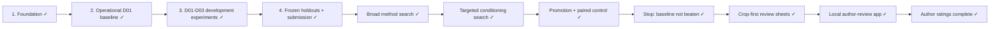

# Garment-consistency experiment plan

**Summary:** The four-slice assignment, follow-up development-only extension, and attributed author review are complete. No tested method reliably improved on direct generation, the automatic evaluator saturated before exact product fidelity, and paid exploration stopped with direct generation retained as the operational baseline. The author rated all 11 frozen outputs; structured and best-of-two tied at `0.667` versus baseline `0.500` on the three initial development cases, while both baseline holdouts scored `0.500`.

```mermaid
flowchart LR
    S1[1. Foundation ✓] --> S2[2. Operational D01 baseline ✓]
    S2 --> S3[3. D01-D03 development experiments ✓]
    S3 --> S4[4. Frozen holdouts + submission ✓]
    S4 --> B[Broad method search ✓]
    B --> T[Targeted conditioning search ✓]
    T --> P[Promotion + paired control ✓]
    P --> D[Stop: baseline not beaten ✓]
    D --> H[Crop-first review sheets ✓]
    H --> UI[Local author-review app ✓]
    UI --> R[Author ratings complete ✓]
```

## Slice 1 — experiment foundation

**Status:** complete.

**Output:** Case loading, prompt rendering, mocked OpenRouter boundary, metadata persistence, packaging, tests, and free CI.

## Slice 2 — operational D01 baseline

**Status:** complete.

**Output:** Guarded paid workflow, compact reference preprocessing, one successful Nano Banana 2 Lite D01 baseline, exact cost/latency evidence, and ChatGPT visual inspection.

**Decision:** Keep `google/gemini-3.1-flash-lite-image` as the operational generator. Seedream's failed long-running requests were sufficient operational evidence.

## Slice 3 — consolidated development experiments

**Status:** complete.

**Cases:** D01, D02, D03 only.

**Compared strategies:** direct baseline, structured garment prompting, and best-of-two VLM selection.

**Result:** Blinded automatic means tied at `0.8889`. ChatGPT visual-assessment means were baseline `0.6833`, structured `0.6500`, and best-of-two `0.6500`. Average end-to-end method cost/latency was baseline `$0.034466 / 5.48 s`, structured `$0.035331 / 8.16 s`, and best-of-two `$0.072624 / 54.89 s`.

**Decision:** Freeze the direct baseline: one `1K`, `3:4` candidate, existing preprocessing, no resampling, and ChatGPT visual assessment alongside rough VLM scoring.

## Slice 4 — frozen holdouts and submission

**Status:** complete.

**Execution:** H01 and H02 were generated once with the frozen baseline. The successful workflow made two image requests, two evaluator requests, zero development requests, and zero retries.

**Result:** H01's automatic result is invalid because the evaluator used `-1` for applicable shoe silhouette; H02's valid automatic score is `1.0000`. No two-case automatic mean is reported. The ChatGPT visual-assessment mean is `0.6667`. Total generation cost was `$0.06940025`, rough evaluation cost was `$0.0026784`, and generation latency was `13.1647 s`.

**Output:** Corrected automatic/ChatGPT visual-assessment CSV evidence, crop-enhanced holdout contact sheets with recorded coordinates, failure taxonomy, cost/latency summary, reproduction guide, and `REPORT.md`.

**Decision:** Freeze outputs and ChatGPT visual judgments exactly as observed. No holdout-driven prompt, model, preprocessing, candidate, rubric, regeneration, or ChatGPT visual-score change was performed; only the invalid automatic aggregation and durable presentation evidence were corrected during review.

## Follow-up development-only method search

**Status:** complete. H01 and H02 remained inaccessible throughout method selection and were not rerun.

### Broad search

**Methods:** direct generation, identity-priority prompting, deterministic garment-detail boards, fixed two-pass repair, and predeclared model swaps.

**Execution:** The guarded search started with `$19.4208539`, ended at `$10.0358314`, spent `$9.3850225`, made 332 paid attempts, and produced 102 valid candidates before the `$10.00` floor guard stopped execution.

**Result:** Some higher-cost methods received perfect automatic scores, but most samples tied the direct baseline, D03 evidence was incomplete, and visual inspection did not establish a reliable improvement.

### Targeted conditioning and promotion

**Methods:** explicit negative constraints, tight garment crops, background removal, garment-first ordering, duplicate garment references, detail boards, best-of-two selection, and garment-focused repair.

**Stage-one result:** `lite_duplicate_garment` scored `0.9940` and `lite_identity_tight_crop` scored `0.9936`, but the run lacked a concurrent direct control and the evaluator was already near saturation.

**Promotion result:** `identity_tight_crop_best_of_two` scored `0.9750` at approximately `$0.0727` and `15.01 s` per candidate. The repeated `lite_direct` control scored `0.9762` at approximately `$0.0360` and `8.53 s` per candidate. Promotion therefore doubled cost without improving the measured result.

**Paired control:** A same-run D01-D03 block produced `lite_direct = 1.0000`, `lite_identity_negative = 1.0000`, and `lite_identity_tight_crop = 0.9667`. A final duplicate-reference block also scored `1.0000`, while visible logo, construction, and material errors remained.

**Final decision:** No tested method is claimed to beat direct generation. The evaluator saturated before exact garment identity was preserved, so paid exploration stopped. Keep `lite_direct` as the operational baseline and add garment-region OCR/logo, construction-detail, and material checks before selective repair, resampling, or human review.

## Author human review

**Status:** complete; all 11 frozen outputs were rated by the assignment author.

**Scope:** D01-D03 baseline, structured, and best-of-two outputs plus the frozen H01-H02 baseline outputs. The reviewer assigned one overall visible garment-fidelity score per output and is identified as the assignment author, not an independent rater.

**Evidence:** The review sheets were rebuilt from the original full-resolution development run `30102014361` and holdout run `30113526488`. No model call, output, score, cost, or experiment decision changed.

**Tooling:** `uv run weon-human-review` opens a one-target-at-a-time local evaluator. One-click presets fill all six frozen dimensions, individual corrections remain available, every edit auto-saves atomically, and JSON/CSV/Markdown exports retain raw ratings, method means, holdouts, notes, and attribution.

**Result:** Baseline `0.500`, structured `0.667`, and best-of-two `0.667` on D01-D03; H01 and H02 frozen baseline outputs both scored `0.500`. This small attributed sanity check is descriptive evidence, not an independent benchmark, and did not retune the frozen automatic or ChatGPT paths.

## Evaluation integrity and provenance

- The final evaluator remained `openai/gpt-4.1-mini` with the same six-dimension rubric, fixed source-level applicability masks, opaque candidate identifiers where required, unchanged aggregation, and raw JSON persisted before validation.
- No automatic retry, score-driven prompt change, method-specific judge prompt, or holdout-driven tuning was used.
- ChatGPT produced the existing visual-assessment scores from committed contact sheets. No independent human evaluator participated; this remains an explicit limitation.
- Author human ratings are stored as separate JSON, CSV, and Markdown evidence and do not replace the frozen automatic or ChatGPT paths.
- Perfect or near-perfect automatic scores were treated as evaluator-ceiling evidence, not proof of exact product fidelity.

## Budget and stopping state

- Paid workflows remained manual/reusable and ran free validation before spending.
- The final observed vendor-key allowance was approximately `$0.03`.
- The low-balance endpoint showed delayed or non-monotonic observations, so per-request costs and committed workflow artifacts are the durable accounting evidence.
- No further meaningful paid experiment is planned without a fresh budget, improved garment-region evaluation, and independent human ratings.

## Constraints honored

- No fine-tuning, deployment, database, generalized benchmark framework, or production orchestration.
- The human-review UI is local-only, dependency-free, and limited to the frozen author-review workflow.
- H01 and H02 remained ungenerated until the development winner and rubric were committed.
- The follow-up search did not access or rerun H01/H02.
- API keys, raw inputs, and standalone generated images are not committed.
- Compact report figures and high-resolution composite review sheets preserve durable visual evidence.
