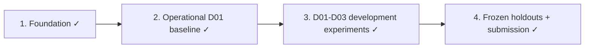

# Garment-consistency experiment plan

**Summary:** Complete. The assignment was delivered as a four-slice evidence-driven experiment rather than a production platform.

```mermaid
flowchart LR
    S1[1. Foundation ✓] --> S2[2. Operational D01 baseline ✓]
    S2 --> S3[3. D01-D03 development experiments ✓]
    S3 --> S4[4. Frozen holdouts + submission ✓]
```

## Slice 1 — experiment foundation

**Status:** complete.

**Output:** Case loading, prompt rendering, mocked OpenRouter boundary, metadata persistence, packaging, tests, and free CI.

## Slice 2 — operational D01 baseline

**Status:** complete.

**Output:** Guarded paid workflow, compact reference preprocessing, one successful Nano Banana 2 Lite D01 baseline, exact cost/latency evidence, and manual garment inspection.

**Decision:** Keep `google/gemini-3.1-flash-lite-image` as the operational generator. Seedream's failed long-running requests were sufficient operational evidence.

## Slice 3 — consolidated development experiments

**Status:** complete.

**Cases:** D01, D02, D03 only.

**Compared strategies:** direct baseline, structured garment prompting, and best-of-two VLM selection.

**Result:** Blinded automatic means tied at `0.8889`. Manual means were baseline `0.6833`, structured `0.6500`, and best-of-two `0.6500`. Average end-to-end method cost/latency was baseline `$0.034466 / 5.48 s`, structured `$0.035331 / 8.16 s`, and best-of-two `$0.072624 / 54.89 s`.

**Decision:** Freeze the direct baseline: one `1K`, `3:4` candidate, existing preprocessing, no resampling, and human review alongside rough VLM scoring.

## Slice 4 — frozen holdouts and submission

**Status:** complete.

**Execution:** H01 and H02 were generated once with the frozen baseline. The successful workflow made two image requests, two evaluator requests, zero development requests, and zero retries.

**Result:** H01's automatic result is invalid because the evaluator used `-1` for applicable shoe silhouette; H02's valid automatic score is `1.0000`. No two-case automatic mean is reported. The manual mean is `0.6667`. Total generation cost was `$0.06940025`, rough evaluation cost was `$0.0026784`, and generation latency was `13.1647 s`.

**Output:** Corrected automatic/manual CSV evidence, crop-enhanced holdout contact sheets with recorded coordinates, failure taxonomy, cost/latency summary, reproduction guide, and `REPORT.md`.

**Decision:** Freeze outputs and human judgments exactly as observed. No holdout-driven prompt, model, preprocessing, candidate, rubric, regeneration, or manual-score change was performed; only the invalid automatic aggregation and durable presentation evidence were corrected during review.

## Constraints honored

- No fine-tuning, UI, deployment, database, dashboard, generalized benchmark framework, or production orchestration.
- Paid workflows are manual/reusable only and have no automatic retry.
- H01 and H02 remained ungenerated until the development winner and rubric were committed.
- API keys, raw inputs, and standalone generated images are not committed.
- Compressed crop-enhanced contact sheets remain as durable submission visual evidence.
