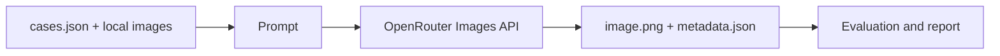

# WEON Garment Consistency Evaluation

A small experiment for testing practical ways to preserve garment details in black-box AI photoshoots.

The repository intentionally prioritizes generated evidence and evaluation over production infrastructure. It uses three development cases to compare a direct baseline, structured prompting, and best-of-two selection. Two additional cases are held out until the strategy and scoring rubric are fixed.

## System



## Setup

Requirements: Python 3.12+ and `uv`.

```bash
uv sync --dev
cp .env.example .env
```

Place the supplied images under:

```text
inputs/
├── environments/{street,meadow,forest}.png
├── garments/{shorts,sneakers,coat}.png
└── models/{black-bodysuit-woman,white-tee-man,cream-sweater-woman}.png
```

Set `OPENROUTER_API_KEY` in your shell or load it from `.env` before running the command. The CLI does not read or print the key.

## Run one baseline

```bash
export OPENROUTER_API_KEY="..."
uv run weon-eval D01
```

Holdout cases are blocked during development. The explicit override is reserved for the frozen final evaluation:

```bash
uv run weon-eval H01 --allow-holdout
```

The result is written to:

```text
outputs/<case>/<model>/<strategy>/
├── image.png
└── metadata.json
```

Metadata records the prompt, references, model, baseline strategy, API-reported cost, and measured request latency. Existing output directories are not overwritten. Inspect an existing result before deciding whether another paid request is justified.

## Validation

```bash
uv run pytest
uv run ruff check .
uv run mypy src
uv build
```

No automated test sends a real API request.
