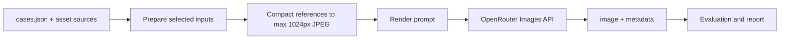

# WEON Garment Consistency Evaluation

A small experiment for testing practical ways to preserve garment details in black-box AI photoshoots.

The repository intentionally prioritizes generated evidence and evaluation over production infrastructure. It uses three development cases to compare a direct baseline, structured prompting, and best-of-two selection. Two additional cases are held out until the strategy and scoring rubric are fixed.

## System


```mermaid
flowchart LR
    A[cases.json + asset sources] --> B[Prepare selected inputs]
    B --> C[Compact references to max 1024px JPEG]
    C --> D[Render prompt]
    D --> E[OpenRouter Images API]
    E --> F[image + metadata]
    F --> G[Evaluation and report]
```

## Setup

Requirements: Python 3.12+ and `uv`.

```bash
uv sync --dev
cp .env.example .env
```

The ignored local input layout is:

```text
inputs/
├── environments/
│   ├── street.png
│   ├── meadow.png
│   └── forest.png
├── garments/
│   ├── shorts.png
│   ├── sneakers.jpg
│   └── coat.png
└── models/
    ├── black-bodysuit-woman.png
    ├── white-tee-man.png
    └── cream-sweater-woman.png
```

The filename extensions follow the actual downloaded bytes rather than the source URL suffixes.

Prepare only the selected development case from the assignment-provided source manifest:

```bash
uv run weon-prepare-inputs D01
```

The downloaded originals remain unchanged. During generation, each reference is rotated according to EXIF metadata, resized in memory to a maximum dimension of 1024 pixels, converted to JPEG quality 85, and recorded in run metadata.

Set `OPENROUTER_API_KEY` in your shell or load it from `.env` before running the generation command. The CLI does not read or print the key.

## Run one baseline locally

The default generator is Nano Banana 2 Lite:

```bash
export OPENROUTER_API_KEY="..."
uv run weon-eval D01
```

Equivalent explicit command:

```bash
uv run weon-eval D01 --model google/gemini-3.1-flash-lite-image
```

The baseline requests one candidate at `1K` and `3:4` through OpenRouter's unified Images API.

## Run one paid experiment in GitHub Actions

The permanent **Run paid experiment** workflow is manual and separate from normal CI:

1. Open **Actions → Run paid experiment → Run workflow**.
2. Choose `D01`, `D02`, or `D03`.
3. Keep or replace the OpenRouter image-model slug.
4. Enable **Confirm that this workflow may spend API credit**.
5. Start the workflow and download the `experiment-<case>-<run-id>` artifact.

Each invocation validates the repository, prepares only the selected case, performs one generation command without retries, and uploads the case output for 14 days. Ordinary pushes and pull requests never trigger this paid workflow.

Holdout cases are blocked during development. The explicit local override is reserved for the frozen final evaluation:

```bash
uv run weon-eval H01 --allow-holdout
```

The result is written to:

```text
outputs/<case>/<model>/<strategy>/
├── image.<jpg|png|webp>
└── metadata.json
```

The generated extension follows the API response. Metadata records the prompt, experiment configuration, output media type, model, baseline strategy, API-reported cost, measured request latency, and original/prepared dimensions and byte sizes for every ordered reference. Existing output directories are not overwritten.

## Validation

```bash
uv run pytest
uv run ruff check .
uv run mypy src
uv build
```

No automated test sends a real API request.
