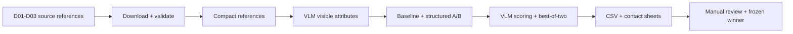

# WEON Garment Consistency Evaluation

A small experiment for testing practical ways to preserve garment details in black-box AI photoshoots.

The repository prioritizes generated evidence and evaluation over production infrastructure. Three development cases compare a direct baseline, structured garment prompting, and best-of-two selection. Two additional cases remain frozen until the development winner and rubric are committed.

## System


```mermaid
flowchart LR
    A[D01-D03 source references] --> B[Download + validate]
    B --> C[Compact references]
    C --> D[VLM visible attributes]
    D --> E[Baseline + structured A/B]
    E --> F[VLM scoring + best-of-two]
    F --> G[CSV + contact sheets]
    G --> H[Manual review + frozen winner]
```

## Setup

Requirements: Python 3.12+ and `uv`.

```bash
uv sync --dev
cp .env.example .env
```

The ignored local input layout is:

```text
inputs/
├── environments/
│   ├── street.png
│   ├── meadow.png
│   └── forest.png
├── garments/
│   ├── shorts.png
│   ├── sneakers.jpg
│   └── coat.png
└── models/
    ├── black-bodysuit-woman.png
    ├── white-tee-man.png
    └── cream-sweater-woman.png
```

The filename extensions follow the actual downloaded bytes rather than the source URL suffixes.

Prepare one development case from the assignment-provided source manifest:

```bash
uv run weon-prepare-inputs D01
```

During generation, originals remain unchanged. Each reference is EXIF-oriented, resized in memory to a maximum dimension of 1024 pixels, composited onto white when transparent, encoded as JPEG quality 85, and recorded in metadata.

Set `OPENROUTER_API_KEY` in the shell before paid commands. The CLI does not read or print the key.

## Run one baseline locally

```bash
export OPENROUTER_API_KEY="..."
uv run weon-eval D01
```

The default generator is `google/gemini-3.1-flash-lite-image`. It requests one `1K`, `3:4` candidate through OpenRouter's unified Images API.

One-run output:

```text
outputs/<case>/<model>/<strategy>/
├── image.<jpg|png|webp>
└── metadata.json
```

Generated bytes are opened and decoded before persistence. The actual format must be JPEG, PNG, or WebP and must agree with any provider-declared media type.

## Run the complete development matrix

Prepare D01-D03, then run the consolidated experiment:

```bash
for case_id in D01 D02 D03; do
  uv run weon-prepare-inputs "$case_id"
done

export OPENROUTER_API_KEY="..."
uv run weon-development
```

Fixed defaults:

- generator: `google/gemini-3.1-flash-lite-image`;
- evaluator: `openai/gpt-4.1-mini`;
- cases: D01, D02, D03 only;
- image calls: 9;
- VLM calls: 6;
- holdout calls: 0;
- automatic retries: 0.

Per case, the command extracts visible garment attributes, generates a baseline and two identical-prompt structured candidates, scores all three against the packshot, reuses candidate A as the standalone structured result, and selects A or B for best-of-two.

The fixed dimensions are color, print/logo, silhouette/length, construction details, texture/material, and garment presence. Scores are `1`, `0.5`, `0`, or `-1` when genuinely not applicable.

Development output:

```text
outputs/development/
├── D01/
│   ├── attributes.json
│   ├── baseline/
│   ├── structured_a/
│   ├── structured_b/
│   ├── best_of_two/
│   ├── evaluation.json
│   └── contact_sheet.jpg
├── D02/
├── D03/
├── results.csv
├── manual_scores.csv
└── development_summary.json
```

`manual_scores.csv` is intentionally blank for human judgments. Fill it after opening the three contact sheets, including whether the automatic selector chose the better structured candidate. Do not resample weak results merely to improve the comparison.

## GitHub Actions paid workflows

Two permanent workflows are manual and separate from normal CI:

- **Run paid experiment** — one D01-D03 generation.
- **Run development matrix** — the complete nine-image, six-VLM development experiment.

For the development matrix:

1. Open **Actions → Run development matrix → Run workflow**.
2. Keep or replace the generator and evaluator model slugs.
3. Enable the paid-run confirmation.
4. Start the workflow.
5. Download `development-matrix-<run-id>`.

Every paid workflow runs dependency sync, Ruff, strict mypy, tests, and build before spending. Successful or partial development evidence is retained for 14 days. Ordinary pushes and pull requests never trigger paid requests.

## Holdout boundary

H01 and H02 are reserved for slice 4. Do not inspect or generate them until the development winner, generator, prompt behavior, preprocessing, selector, and rubric are committed.

The explicit single-case override exists only for the frozen final evaluation:

```bash
uv run weon-eval H01 --allow-holdout
```

The development command exposes no holdout option and requires D01-D03 to be marked as development cases.

## Validation

```bash
uv run ruff check .
uv run mypy src
uv run pytest
uv build
```

No automated test sends a real API request.
