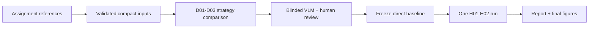

# WEON Garment Consistency Evaluation

A focused experiment on preserving garment identity in black-box AI photoshoots.

The repository compares a direct baseline with structured garment prompting and best-of-two selection on three development cases, then applies the frozen winner once to two holdouts. Start with [REPORT.md](REPORT.md) for the results and conclusions.

## Final result

The direct baseline was selected:

- development blinded automatic mean: `0.8889` for every strategy;
- development manual mean: baseline `0.6833`, structured `0.6500`, best-of-two `0.6500`;
- holdout automatic mean: `1.0000`;
- holdout manual mean: `0.6667`;
- holdout generation cost: `$0.06940025` for two images;
- holdout generation latency: `13.1647 s` total.

Broad color, garment presence, and coarse silhouette were generally preserved. Logos, exact construction, and material details remained unreliable, and the VLM evaluator was substantially overconfident on the holdouts.


```mermaid
flowchart LR
    A[Assignment references] --> B[Validated compact inputs]
    B --> C[D01-D03 strategy comparison]
    C --> D[Blinded VLM + human review]
    D --> E[Freeze direct baseline]
    E --> F[One H01-H02 run]
    F --> G[Report + final figures]
```

## Repository guide

- `REPORT.md` — final 1–4 page-equivalent technical report.
- `experiments/slice-3-development.md` — development evidence and winner decision.
- `experiments/slice-4-holdout.md` — frozen holdout evidence.
- `submission/figures/` — compressed before/after and comparison visuals.
- `specs/` — fixed slice specifications.
- `src/weon_eval/` — runnable experiment code.

## Setup

Requirements: Python 3.12+ and `uv`.

```bash
uv sync --dev
cp .env.example .env
export OPENROUTER_API_KEY="..."
```

Inputs are ignored by Git and downloaded from the assignment-provided source manifest. During generation, originals remain unchanged. Each reference is EXIF-oriented, resized in memory to at most 1024 pixels, composited onto white when transparent, encoded as JPEG quality 85, and recorded in metadata.

## Run one baseline

```bash
uv run weon-prepare-inputs D01
uv run weon-eval D01
```

The default generator is `google/gemini-3.1-flash-lite-image`. It requests one `1K`, `3:4` image with references ordered as person, environment, and garment packshot(s).

Output:

```text
outputs/<case>/<model>/<strategy>/
├── image.<jpg|png|webp>
└── metadata.json
```

Generated bytes are decoded and validated before persistence. JPEG, PNG, and WebP are supported, and the actual format must agree with any provider-declared media type.

## Reproduce the development matrix

```bash
for case_id in D01 D02 D03; do
  uv run weon-prepare-inputs "$case_id"
done

uv run weon-development
```

The fixed matrix makes nine image requests and six VLM requests with no retries or holdout access. It compares:

1. `baseline` — one direct generation;
2. `structured` — packshot attributes injected as hard prompt constraints;
3. `best_of_two` — two structured candidates with VLM selection.

Comparative scoring uses opaque candidate IDs and a deterministic case-specific permutation. The six dimensions are color, print/logo, silhouette/length, construction details, texture/material, and garment presence, scored as `1`, `0.5`, `0`, or `-1` when genuinely not applicable.

## Reproduce the frozen holdouts

The explicit override is restricted to the final fixed evaluation:

```bash
uv run weon-prepare-inputs H01 --allow-holdout
uv run weon-prepare-inputs H02 --allow-holdout
uv run weon-holdout
```

This command uses the committed baseline configuration and makes exactly two generation requests and two rough evaluator requests. It exposes no strategy-selection option, performs no retries or resampling, and does not access D01-D03.

## GitHub Actions

Permanent paid workflows are manual/reusable and separate from normal CI:

- **Run paid experiment** — one D01-D03 baseline call;
- **Run development matrix** — the development comparison;
- **Run frozen holdouts** — the fixed H01-H02 evaluation.

Every paid workflow runs dependency sync, Ruff, strict mypy, tests, and build before spending. Artifacts are retained for 14 days. Ordinary pushes and pull requests never trigger paid requests.

## Validation

```bash
uv run ruff check .
uv run mypy src
uv run pytest
uv build
```

No automated test sends a real API request. Raw inputs and standalone generated images are not committed; only compact CSV/Markdown evidence and final compressed contact sheets are included for review.
