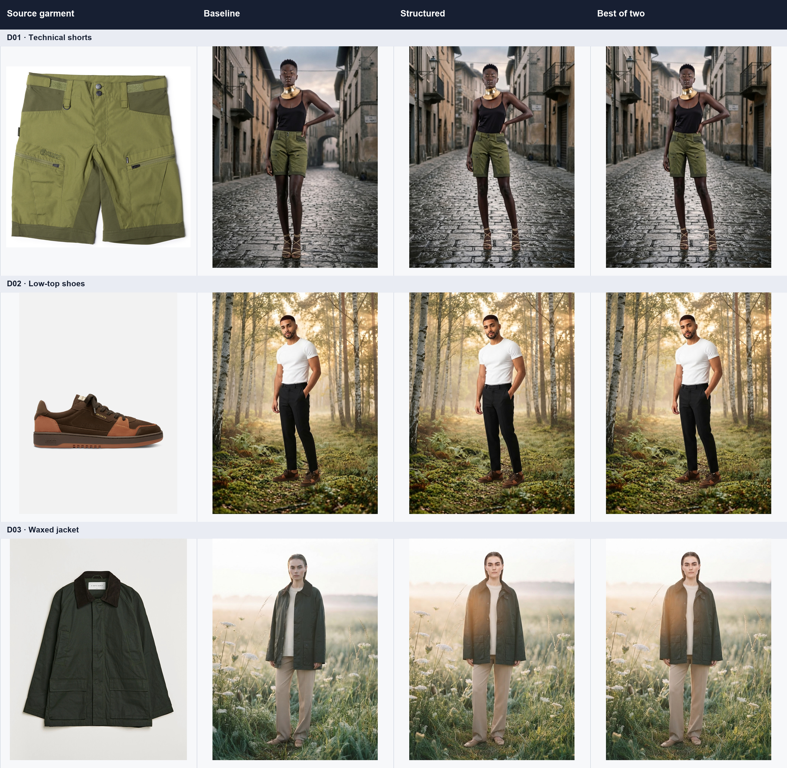
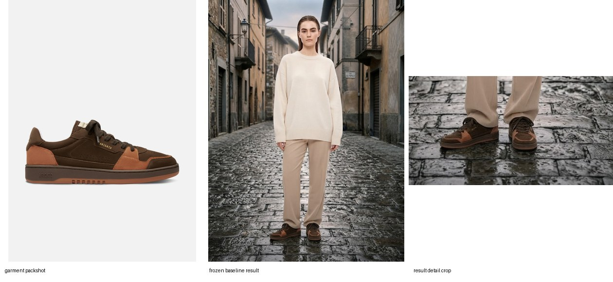
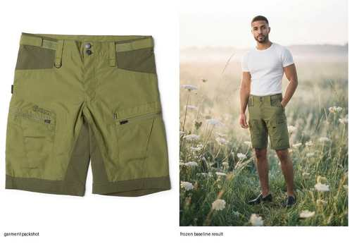

# Improving garment consistency in black-box AI photoshoots

## Executive summary

The goal was to compose a person, an environment, and a garment packshot while preserving the garment as a specific product - not merely as the right category or color.

I tested four families of levers available around closed-source image models:

1. **Prompt engineering:** structured garment descriptions, identity-priority instructions, and explicit negative constraints.
2. **Input conditioning:** tighter garment crops, background removal, detail boards, reference ordering, and duplicated garment evidence.
3. **Pipeline design:** best-of-two selection and one garment-focused repair pass.
4. **Model choice:** several image-generation models under one frozen evaluation contract.

The result is negative but actionable: **none of the tested methods reliably beat direct Gemini 3.1 Flash Lite generation.** The strongest promoted pipeline scored `0.9750`, versus `0.9762` for the repeated direct control, while costing about twice as much. A later paired D01-D03 check tied direct generation with identity-plus-negative prompting at `1.0000` and placed identity-plus-tight-crop below both at `0.9667`.

Those scores overstate real quality. Methods sometimes received `1.0000` while logos were unreadable, pocket and zipper geometry changed, shoe panels and soles drifted, and materials were simplified. The automatic judge was useful for rough screening, but it saturated before exact product fidelity was achieved.

**Recommendation:** retain direct generation as the operational baseline. In production, add a cheap garment-region quality gate and escalate only failures to resampling, targeted repair, or human review.



The compact collage is a report summary, not a rating surface. Human scoring should use the separate [high-resolution author-review sheets](submission/HUMAN_REVIEW.md), which show each source garment, full generated candidate, and garment-region crop. The sheets are prepared; numeric author ratings are pending.

## 1. Failure-mode analysis

The observed errors form a small, repeatable taxonomy:

- **Branding loss or hallucination:** logos and text disappear, become unreadable, or turn into approximate invented marks.
- **Construction drift:** buttons, zippers, pockets, seams, panels, collars, soles, and closures move, simplify, or change count.
- **Texture simplification:** suede/leather boundaries, technical fabric, waxed coating, corduroy, perforation, and stitching lose specificity.
- **Color drift:** lighting and scene integration can move dark green toward olive/brown or flatten local color differences.
- **Silhouette drift:** garment length, collar proportions, toe shape, sole thickness, and panel outline change.
- **Evaluator overconfidence:** a general VLM often recognizes the right garment category and broad palette while missing identity-critical details.
- **Applicability errors:** the evaluator may incorrectly mark a difficult dimension as not applicable, silently improving the denominator unless validated.

This distinction is fundamental: a plausible pair of brown low-top shoes is not necessarily the referenced product. For a fashion brand, exact text, panel geometry, closures, and material boundaries are part of the identity.

## 2. Methods and experiment design

Five distinct assignment cases were used: D01-D03 for development and H01-H02 as frozen holdouts. The development cases were sampled repeatedly because image generation is stochastic; holdouts were run once after the initial strategy decision.

The main generator was `google/gemini-3.1-flash-lite-image` through OpenRouter, requesting one `1K`, `3:4` output. References were EXIF-oriented, resized in memory to at most 1024 pixels, composited onto white when transparent, and JPEG-encoded at quality 85.

The search included:

- direct person + environment + garment generation;
- VLM-derived structured garment attributes;
- identity-priority and negative-constraint prompts;
- tight garment crops and background-removed packshots;
- garment-first reference ordering;
- duplicate garment references as a crude weighting mechanism;
- multi-panel detail boards;
- best-of-two generation with blinded selection;
- a second garment-focused repair pass;
- alternative image models.

### Frozen evaluation

Every final candidate was judged on six dimensions:

1. color;
2. print/logo;
3. silhouette/length;
4. construction details;
5. texture/material;
6. garment presence.

Scores were `1`, `0.5`, `0`, or `-1` only when the source truly made a dimension inapplicable. The final evaluator remained `openai/gpt-4.1-mini` with the same prompt, schema, applicability masks, and aggregation. Candidate IDs were opaque where comparison or selection occurred. Raw evaluator JSON was persisted before validation. Method selection had no access to H01-H02, no automatic retries, and no method-specific judge prompt or metric reweighting.

A separate ChatGPT visual assessment reviewed committed contact sheets using the same concepts. This was an AI sanity check, **not independent human evaluation**. A human sanity-check path is now prepared from the frozen full-resolution artifacts; its pending ratings will be explicitly attributed to the assignment author.

## 3. Results

### Operational comparison

| Method | Automatic mean | Average cost | Average latency | Interpretation |
| --- | ---: | ---: | ---: | --- |
| `lite_direct` | **0.9762** | **$0.0360** | **8.53 s** | Best operational baseline |
| `lite_duplicate_garment` | 0.9940 | $0.0365 | 9.00 s | Nominal stage-one leader, but no same-run baseline and no stable visual gain |
| `lite_identity_tight_crop` | 0.9936 | $0.0360 | 8.76 s | Nominal stage-one result; later lost in paired check |
| `identity_tight_crop_best_of_two` | 0.9750 | $0.0727 | 15.01 s | Essentially baseline score at roughly 2x cost |
| `duplicate_garment_repair` | 0.9711 | $0.0708 | 13.16 s | More expensive and lower-scoring |

The small stage-one lead for duplicated garment evidence and identity-plus-tight-crop was not a clean paired win because that run lacked a concurrent direct control. A later fixed D01-D03 block provided the direct comparison:

| Same-run method | Automatic mean | Average cost | Average latency |
| --- | ---: | ---: | ---: |
| `lite_direct` | **1.0000** | $0.0358 | 8.94 s |
| `lite_identity_negative` | **1.0000** | $0.0361 | 8.45 s |
| `lite_identity_tight_crop` | 0.9667 | $0.0359 | 7.81 s |

This tiny block does not prove that direct and identity-plus-negatives are truly equivalent. It does show that tight-crop conditioning did not reliably improve the baseline and that the automatic judge had reached a ceiling.

A final duplicate-reference D01-D03 block also received `1.0000`. Visual inspection still found unreadable or incorrect branding, approximate shoe panel and sole construction, and drifted jacket pockets, closure, collar, seams, and material. A perfect score therefore meant "the judge could not distinguish the remaining errors," not "the garment was exact."

### Initial controlled comparison and holdouts

The initial development matrix compared direct generation, structured prompting, and structured best-of-two. The blinded automatic mean tied at `0.8889` for all three. ChatGPT visual-assessment means were baseline `0.6833`, structured `0.6500`, and best-of-two `0.6500`. Best-of-two cost roughly twice as much and was much slower, so direct generation was frozen for the holdouts.

High-resolution development review sheets:

- [D01 technical shorts](submission/review/D01-human-review.png)
- [D02 low-top shoes](submission/review/D02-human-review.png)
- [D03 waxed jacket](submission/review/D03-human-review.png)



[Open the high-resolution H01 review sheet](submission/review/H01-human-review.png).



[Open the high-resolution H02 review sheet](submission/review/H02-human-review.png).

| Holdout | Automatic result | ChatGPT visual assessment | Generation cost | Total latency |
| --- | ---: | ---: | ---: | ---: |
| H01 sneakers | Invalid - source applicability violation | 0.5833 | $0.0345 | 8.43 s |
| H02 shorts | 1.0000 | 0.7500 | $0.0349 | 10.25 s |

H01's evaluator response incorrectly assigned `silhouette_length = -1` to footwear. The predeclared source mask required that dimension, so the raw response was retained but rejected from aggregation. H02 preserved the broad color, length, double-button waist, belt loops, and cargo layout, but branding, zipper placement, panel geometry, stitching, and technical-fabric texture remained approximate.

### Author human review

The [author human-review protocol](submission/HUMAN_REVIEW.md) covers all nine initial development method outputs plus the two frozen holdouts using the same six dimensions. It deliberately excludes scene realism and asks the reviewer to score source-to-garment fidelity from the high-resolution detail crops.

The materials are complete, but the numeric ratings are not yet recorded. Until they are supplied, this report makes no human-score claim. When added, they will remain a separate attributed evidence path and will not replace or retune the frozen automatic or ChatGPT results.

## 4. Practical conclusion and production design

The direct Lite method is the correct baseline when the requirement is a fast, inexpensive first pass. It is **not** sufficient for brand-critical catalog production where exact logos, seams, closures, panels, or materials must match.

The production system I would build is asymmetric:

```text
Direct generation
      |
Garment-region quality gate
      |
      +-- pass --> deliver
      |
      +-- fail --> targeted repair or one resample
                         |
                         +-- still fail --> human review / reject
```

The gate should not be one general VLM score. It should combine checks matched to the failure modes:

- OCR or logo matching for text-heavy products;
- local color statistics on the garment crop;
- crop-level visual embeddings for broad structure;
- explicit VLM questions about pocket count, closures, buttons, and major panels;
- source-applicability validation;
- a calibrated reject threshold measured against independent human judgments.

This keeps the common path near the baseline's `$0.036` and 8-9 second cost/latency, while spending extra calls only where evidence says the product identity is wrong. The experiments show that always-on best-of-two or repair is poor economics: it roughly doubles cost without a demonstrated gain.

## 5. What I would do next

With a fresh budget and independent raters, I would prioritize:

1. **Garment-region evaluation inputs:** judge tight aligned crops rather than full scenes where the product occupies few pixels.
2. **Explicit OCR/logo evaluation:** branding was the clearest blind spot of the general VLM judge.
3. **A larger stratified set:** text-heavy garments, patterns, layered outfits, small accessories, reflective materials, and multiple views.
4. **Independent human ratings:** use them to calibrate automatic thresholds and measure false acceptance, not merely average score.
5. **Targeted repair only after failure localization:** inpaint or edit the garment region instead of regenerating the full scene.
6. **Decision metrics:** report pass rate at a required fidelity threshold, cost per accepted image, and false-accept rate - not only a mean similarity score.

## Limitations and disclosure

This is a focused exploration, not a large benchmark. It uses five distinct cases with repeated development samples. No independent human reviewer participated. High-resolution author-review materials are prepared, but their ratings are pending. ChatGPT performed the existing visual-assessment path and assisted with implementation, orchestration, analysis, evidence layout, and writing. Image outputs came from the tested generation models; automatic scores and best-of-two selection used GPT-4.1 Mini.

The final vendor-key allowance observation was about `$0.03`. The provider balance endpoint showed delayed or non-monotonic values at very low balance, so per-request costs and committed workflow artifacts are treated as the durable accounting evidence.
