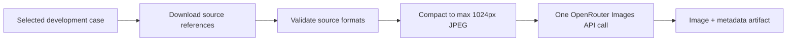

# Paid Experiment Workflow Implementation Plan

**Goal:** Make one paid development-case generation reproducible without coupling API spending to normal CI.

**Architecture:** A selected-case input command downloads and validates assignment references. The runner compacts those originals in memory, calls OpenRouter's unified Images API once, and persists the returned image with cost, latency, output format, and preprocessing metadata. A permanent manual/reusable GitHub Actions workflow validates the repository before invoking that paid path.

## Constraints

- Paid generation is triggered only by `workflow_dispatch` or explicit `workflow_call`.
- Ordinary push and pull-request CI remains free.
- Only `D01`, `D02`, and `D03` are accepted during development.
- Each invocation runs one case, one model, one prompt, one candidate, and no retry.
- `OPENROUTER_API_KEY` is read only from GitHub Actions secrets.
- Holdout cases remain blocked.
- Inputs and generated outputs remain Git-ignored and are published only as short-lived artifacts.

## Task 1: Prepare assignment inputs

- [x] Add `asset_sources.json` for the supplied public references.
- [x] Download only the selected case in model, environment, garment order.
- [x] Validate PNG and JPEG bytes against local filename extensions.
- [x] Correct misleading source suffixes: shorts and coat are PNG; sneakers is JPEG.
- [x] Add focused tests and the `weon-prepare-inputs` command.

## Task 2: Compact generation references

- [x] Apply EXIF orientation without modifying original files.
- [x] Preserve aspect ratio and resize to a maximum dimension of 1024 pixels.
- [x] Composite transparency onto white and encode JPEG quality 85.
- [x] Record original dimensions, prepared dimensions, byte count, and media type.
- [x] Add Pillow as the sole new production dependency.

## Task 3: Persist unified Image API results

- [x] Request one `1K`, `3:4` candidate.
- [x] Use `google/gemini-3.1-flash-lite-image` as the operational baseline after Seedream failed to return an artifact.
- [x] Persist JPEG, PNG, or WebP according to the response media type.
- [x] Record cost, latency, prompt, strategy, model, and image filename.
- [x] Cover payload order, preprocessing, response media types, and metadata with tests.

## Task 4: Permanent guarded workflow

- [x] Add manual `workflow_dispatch` and reusable `workflow_call` entry points.
- [x] Require explicit spending confirmation and a configured repository secret.
- [x] Serialize paid runs by case and disable cancellation of an active run.
- [x] Run dependency sync, Ruff, strict mypy, pytest, and build before spending.
- [x] Upload successful outputs for 14 days.

## Task 5: Execute D01 once

- [x] Run the final operational D01 request from an isolated one-use caller branch.
- [x] Verify the returned image opens and is exactly 3:4.
- [x] Inspect composition and garment fidelity manually.
- [x] Remove execution machinery from the final slice branch.
- [x] Record the final evidence and slice-3 decision in `experiments/D01-baseline.md`.

## Final verification

- [x] Ruff passes.
- [x] Strict mypy passes.
- [x] Fourteen tests pass.
- [x] Package build passes.
- [x] Permanent paid workflow has no automatic event trigger.
- [x] No D02, D03, H01, or H02 generation was made during slice 2.
