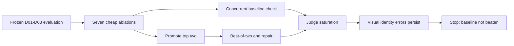

# Targeted garment-conditioning search: final result

## Decision

Stop paid exploration and keep `lite_direct` as the operational baseline.

The targeted stage-one screen produced two nominal automatic leaders, `lite_duplicate_garment` and `lite_identity_tight_crop`, but neither is proven to beat the baseline in a practically meaningful way. A later concurrent-control screen tied `lite_direct` with identity-plus-negatives and put identity-plus-tight-crop below baseline. The fixed promotion stage approximately doubled cost without improving the aggregate score. A final duplicate-reference block received a perfect judge score while still showing visible identity errors, confirming evaluator saturation.

This is a negative result, not a failed experiment: the search answered the useful question. Cheap reference-conditioning tricks can move a saturated VLM score slightly, but the tested methods still do not reliably preserve exact product identity.

## Frozen protocol

The paid runs retained the committed evaluation protocol:

- development cases `D01-D03` only;
- evaluator `openai/gpt-4.1-mini`;
- the same six dimensions: color, print/logo, silhouette/length, construction details, texture/material, and presence;
- source-level applicability masks;
- blinded candidate labels where selection was used;
- unchanged aggregation;
- no holdout access;
- no automatic retries;
- no score-driven prompt, case, metric, or judge changes during execution.

## Executions

### Stage one

GitHub Actions run `30147851575`, artifact `targeted-ablation-stage1-30147851575`:

- starting allowance: `$9.96237695`;
- ending allowance: `$5.6660722`;
- spend: `$4.29630475`;
- paid requests: `240`;
- valid candidates: `102`;
- invalid evaluator responses: `18`;
- stop reason: floor guard;
- nominal winner: `lite_duplicate_garment` at `0.9940476`.

The promoted methods were:

1. `lite_duplicate_garment` — automatic mean `0.9940476`, average cost `$0.036461`, average latency `9.00 s`;
2. `lite_identity_tight_crop` — automatic mean `0.9935897`, average cost `$0.036001`, average latency `8.76 s`.

The original stage-one run did not contain a concurrent `lite_direct` control. A full rerun was later blocked by its floor guard, so the small stage-one score difference must not be presented as a paired baseline win.

### Minimal concurrent-control follow-up

GitHub Actions run `30151034490`, artifact `minimal-targeted-screen-30151034490`, ran one fixed D01-D03 block for three cheap methods:

| Method | Automatic mean | Average cost | Average latency |
| --- | ---: | ---: | ---: |
| `lite_direct` | 1.0000 | $0.035822 | 8.94 s |
| `lite_identity_negative` | 1.0000 | $0.036148 | 8.45 s |
| `lite_identity_tight_crop` | 0.9667 | $0.035862 | 7.81 s |

Execution spent `$0.21590985` across 18 paid requests, produced nine valid candidates, and stopped at its request cap with no failures. This tiny paired block does not prove equivalence, but it directly contradicts a claim that identity-plus-tight-crop reliably beats baseline. It also shows the judge saturating at `1.0000` for both baseline and identity-plus-negatives despite visible product-detail errors.

### Promotion

GitHub Actions run `30149506865`, artifact `top-two-promotion-search-30149506865`:

- starting allowance: `$5.6302718`;
- ending allowance: `$0.49995015`;
- spend: `$5.13032165`;
- paid requests: `252`;
- valid candidates: `63`;
- invalid evaluator responses: `9`;
- stop reason: floor guard;
- nominal winner: `identity_tight_crop_best_of_two` at `0.9750`.

| Method | Automatic mean | Average cost | Average latency |
| --- | ---: | ---: | ---: |
| `identity_tight_crop_best_of_two` | 0.9750 | $0.072665 | 15.01 s |
| `duplicate_garment_repair` | 0.9711 | $0.070767 | 13.16 s |
| `identity_tight_crop_repair` | 0.9643 | $0.070678 | 12.58 s |
| `duplicate_garment_best_of_two` | 0.9479 | $0.072999 | 17.47 s |

For context, the earlier broad search measured `lite_direct` at `0.9761905`, average cost `$0.036010`, and average latency `8.53 s`. The promotion winner was therefore roughly twice as expensive while scoring essentially the same as that prior direct control.

### Final remaining-conditioning screen

A one-use screen completed in run `30151206748`, artifact `remaining-conditioning-screen-30151206748`:

- starting allowance: `$0.1404595`;
- ending allowance: `$0.03133895`;
- reported spend: `$0.10912055`;
- paid requests: `10`;
- valid candidates: `3`;
- failed evaluator calls: `2` because the key could not afford the requested maximum tokens;
- stop reason: floor guard.

Only one complete `lite_duplicate_garment` block survived, scoring `1.0000` on D01-D03. The planned detail-board comparison did not complete, so this cannot establish a comparative winner. More importantly, visual inspection still found incorrect or unreadable branding, approximate shoe panel/sole geometry, and drifted jacket pocket, closure, collar, and material details. The perfect score is direct evidence of judge saturation, not proof of exact garment preservation.

The allowance endpoint returned non-monotonic or delayed values during the final low-balance runs. Provider-reported per-request costs and artifact metadata are retained, but allowance snapshot differences should not be treated as exact billing reconciliation.

## Visual audit

ChatGPT inspected garment-region contact sheets containing six repeated outputs per main method for `D01-D03`, the concurrent-control outputs, and the final duplicate-reference block. This was an AI visual assessment, not independent human review.

The automatic scores were visibly overconfident:

- **D01 shorts:** logos were absent, unreadable, or invented; zipper positions, pocket shapes, dark reinforcement panels, stitching, and hem geometry varied across every method.
- **D02 shoes:** the broad brown/orange palette and low-top category survived, but exact `ARIGATO` branding, toe-panel geometry, sole construction, perforation, and material boundaries did not.
- **D03 jacket:** color and coarse silhouette were stable, but collar proportions, front closure, pocket dimensions, seams, and waxed-material appearance still drifted.

`lite_duplicate_garment`, `lite_identity_tight_crop`, and promoted best-of-two outputs occasionally looked better on one detail, but the advantage did not repeat consistently. Best-of-two selection also chose outputs that still contained obvious identity errors.

## Why no winner is claimed

A method counts as better only when the gain is material, visibly real, and worth its cost. That bar was not met:

1. stage-one differences were tiny and initially unpaired against a concurrent direct control;
2. the later paired block tied baseline with identity-plus-negatives and put identity-plus-tight-crop below it;
3. valid sample counts were unequal because the frozen applicability validator rejected evaluator mistakes;
4. the judge frequently assigned perfect or near-perfect scores to images with visible branding and construction errors;
5. promotion approximately doubled cost and still failed to exceed the prior direct-control score;
6. the final perfect-score block visibly retained the same product-identity failures;
7. visual inspection showed no stable product-identity improvement.

## Final recommendation

Use `lite_direct` when coarse garment identity is sufficient. Do not claim any tested method is reliable for brand-critical catalog work.

For a future, separately budgeted study, the only candidates worth carrying forward are `lite_duplicate_garment` and `lite_identity_tight_crop`, evaluated on a larger case set with a concurrent baseline, garment-region review, explicit OCR/logo checks, and independent human raters. The last observed allowance is about `$0.03`, so no further meaningful paid run should be attempted.

## AI disclosure

The experiment implementation, execution orchestration, result analysis, visual audit, and this record were prepared with ChatGPT. Image generation used Gemini 3.1 Flash Lite Image. Automatic scoring and best-of-two selection used GPT-4.1 Mini. No independent human reviewer participated in this final search.
