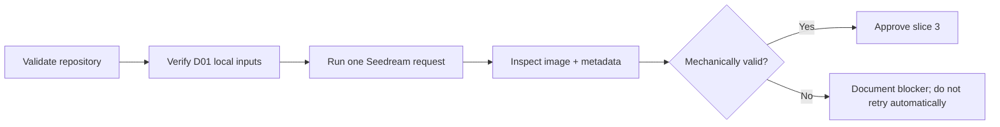

# Slice 2 specification: first live D01 baseline

**Summary:** Prove the existing baseline runner works end to end by executing exactly one paid Seedream generation for development case D01, inspecting the generated image and metadata, and recording whether the experiment is ready to expand to the model-comparison slice.

**Roadmap position:** Slice 2 of 7. Slice 1, the offline experiment foundation, is complete and merged.



## 1. Goal

Produce the first real baseline artifact and answer one narrow question:

> Can the current runner send the intended model, environment, and garment references to Seedream, persist a usable result, and capture enough metadata for later comparison?

This slice validates experiment mechanics. It does not evaluate whether Seedream is the best model or whether the baseline prompt improves garment consistency.

## 2. Assignment alignment

The assignment prioritizes practical black-box experimentation, before/after evidence, garment-fidelity analysis, and honest cost and latency reporting. It explicitly does not reward production infrastructure or exhaustive benchmarking.

This slice therefore spends one controlled call to create evidence before adding more code or expanding the experiment matrix.

## 3. Fixed experiment configuration

No parameter may be tuned within this slice.

| Field | Required value |
| --- | --- |
| Case | `D01` |
| Split | `development` |
| Model reference | `inputs/models/black-bodysuit-woman.png` |
| Environment reference | `inputs/environments/street.png` |
| Garment reference | `inputs/garments/shorts.png` |
| Generator | `bytedance-seed/seedream-4.5` |
| Prompt | `prompts/baseline.txt` rendered for D01 |
| Strategy label | `baseline` |
| Candidate count | `1` |
| Aspect ratio | `3:4` |
| Resolution | `2K` |
| Automatic retries | `0` |
| Maximum live requests | `1` |

The reference order remains:

1. model/person;
2. environment;
3. garment packshot.

## 4. Preconditions

Before any paid request:

1. `main` contains the merged slice-1 foundation.
2. The three D01 input paths exist locally and are readable.
3. `OPENROUTER_API_KEY` is present in the shell environment and is never printed or committed.
4. `outputs/D01/bytedance-seed_seedream-4.5/baseline/` does not already exist.
5. The following validation commands pass:

```bash
uv run ruff check .
uv run mypy src
uv run pytest
uv build
```

Failure of any precondition blocks the live call.

## 5. Execution

Run exactly:

```bash
uv run weon-eval D01
```

The slice must not introduce a wrapper that loops, retries, samples multiple candidates, or calls another model.

### Failure policy

- A missing or unreadable input is fixed locally before any API request.
- An API error is recorded after secret sanitization.
- A failed live request ends slice 2 as `blocked`.
- Any retry is outside this slice and requires a separately approved follow-up after identifying the concrete failure.
- A visually poor but mechanically valid image counts as the baseline result and must not be regenerated in this slice.

Negative results are evidence, not a reason to resample.

## 6. Expected local artifacts

The successful run must create:

```text
outputs/D01/bytedance-seed_seedream-4.5/baseline/
├── image.png
└── metadata.json
```

These files remain local and ignored by Git unless publication rights for the supplied assets are confirmed.

`metadata.json` must contain:

- `case_id = "D01"`;
- `model = "bytedance-seed/seedream-4.5"`;
- `strategy = "baseline"`;
- the exact rendered prompt;
- the three ordered reference paths;
- API-reported `cost_usd`, or `null` when unavailable;
- measured `latency_seconds`.

The image must be non-empty and open successfully in a standard image viewer. No additional image-validation framework is required.

## 7. Manual inspection

Inspect the generated image against all three D01 references.

Record only visible, supportable observations under these headings:

### Composition mechanics

- Is the intended person present?
- Is the street environment recognizably used?
- Is the shorts garment present and worn rather than merely copied into the scene?

### Garment consistency

- Color preservation
- Print or logo preservation, when present in the packshot
- Overall silhouette and length
- Waistband, seams, closures, pockets, or other visible construction details
- Fabric appearance or texture
- Hallucinated or missing details

Use these labels for each applicable garment dimension:

- `preserved`;
- `partially preserved`;
- `drifted`;
- `not visible`;
- `not applicable`.

This is a qualitative smoke inspection, not the final scoring rubric.

## 8. Committed slice record

After the live run, add `experiments/D01-baseline.md` containing:

- UTC execution timestamp;
- exact command without secrets;
- case, model, prompt path, and strategy;
- output directory;
- reported cost and measured latency;
- the manual inspection labels and concise evidence;
- any API or rendering anomaly;
- the final decision: `proceed to slice 3` or `blocked`.

Do not commit the API key, raw request headers, input images, generated output, or unrelated environment details.

## 9. Code-change policy

The default expectation is no production-code change. The runner already implements the required request and persistence path.

Code may change only when the live run exposes a concrete incompatibility that prevents this exact D01 request from completing or being inspected. Any such change must:

1. reproduce the issue in a focused test where possible;
2. be the smallest fix for the observed failure;
3. avoid adding capability discovery, balance preflight, retries, or orchestration abstractions;
4. pass lint, type checking, tests, and build before another live request is considered in a separately approved follow-up.

## 10. Pull-request requirements

The slice-2 implementation PR must include:

- the high-level DAG from this specification;
- the exact number of live requests made;
- cost and latency from metadata;
- the manual inspection conclusion;
- a link or attachment to the generated result only when publication rights allow it;
- explicit confirmation that no holdout case was executed;
- one-line per-file change summary;
- AI disclosure for AI-generated review or explanatory comments.

## 11. Non-goals

This slice does not:

- compare Seedream with Gemini;
- run D02, D03, H01, or H02;
- tune or rewrite the baseline prompt;
- add structured garment attributes;
- implement VLM scoring;
- generate best-of-two candidates;
- define the final evaluation rubric;
- add production safeguards or deployment infrastructure;
- rerun because the output is aesthetically weak or garment fidelity is poor.

Those belong to later slices.

## 12. Definition of done

Slice 2 is complete only when:

1. all four repository validation commands pass;
2. no more than one live request has been sent;
3. the generated image opens successfully;
4. metadata contains the exact experiment identity, ordered references, cost field, and latency;
5. D01 is manually inspected against the source references;
6. `experiments/D01-baseline.md` records the evidence and decision;
7. no holdout or additional development case was executed;
8. the PR documents the system flow and result without exposing secrets;
9. the decision gate is explicit.

### Decision gate

Proceed to slice 3 only when the request is mechanically valid and the saved artifacts are sufficient for a fair Seedream-versus-Gemini comparison.

A garment-fidelity failure does not block slice 3; it is the baseline evidence that slice 3 and the later improvement strategies are meant to address.
