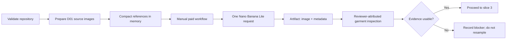

# Slice 2 specification: first reproducible D01 baseline

**Summary:** Produce one mechanically valid, reproducible D01 baseline through the permanent paid workflow, persist the generated image and metadata, inspect garment fidelity, and decide whether the experiment can expand to the development-set comparison.

**Roadmap position:** Slice 2 of 7. Slice 1, the offline experiment foundation, is complete and merged.


```mermaid
flowchart LR
    A[Validate repository] --> B[Prepare D01 source images]
    B --> C[Compact references in memory]
    C --> D[Manual paid workflow]
    D --> E[One Nano Banana Lite request]
    E --> F[Artifact: image + metadata]
    F --> G[Reviewer-attributed garment inspection]
    G --> H{Evidence usable?}
    H -->|Yes| I[Proceed to slice 3]
    H -->|No| J[Record blocker; do not resample]
```

## 1. Goal

Answer one narrow question:

> Can the experiment runner prepare the supplied D01 references, send one controlled image-generation request, persist a usable artifact with cost and latency metadata, and support an honest garment-consistency inspection?

This slice validates mechanics and produces baseline evidence. It does not optimize garment fidelity.

## 2. Model decision

The initial Seedream 4.5 request timed out without returning an artifact. A separately isolated diagnostic established that OpenRouter connectivity was healthy and that `google/gemini-3.1-flash-lite-image` could compose the same D01 references after compact preprocessing.

The operational slice-2 baseline is therefore fixed to Nano Banana 2 Lite. The model change is evidence-driven, not a quality-tuning loop.

## 3. Fixed D01 configuration

| Field | Required value |
| --- | --- |
| Case | `D01` |
| Split | `development` |
| Model reference | `inputs/models/black-bodysuit-woman.png` |
| Environment reference | `inputs/environments/street.png` |
| Garment reference | `inputs/garments/shorts.png` |
| Generator | `google/gemini-3.1-flash-lite-image` |
| Prompt | `prompts/baseline.txt` rendered for D01 |
| Strategy | `baseline` |
| Candidate count | `1` |
| Aspect ratio | `3:4` |
| Resolution | `1K` |
| Automatic retries | `0` |
| Final operational D01 requests | `1` |

The reference order is model/person, environment, then garment packshot.

## 4. Reference preprocessing

The original ignored input files remain unchanged. Immediately before generation, each reference is prepared in memory using the same deterministic policy:

1. apply EXIF orientation;
2. preserve aspect ratio;
3. resize so neither dimension exceeds `1024` pixels;
4. composite transparency onto white when needed;
5. encode as JPEG at quality `85`;
6. pass the compact result as a base64 data URL.

For every reference, metadata records:

- original path;
- original dimensions;
- prepared dimensions;
- prepared byte count;
- prepared media type.

This keeps the request below provider download limits while retaining enough detail for the baseline experiment.

## 5. Permanent automation

`.github/workflows/run-experiment.yml` remains manual and separate from ordinary CI. It exposes only:

- `workflow_dispatch` for an explicit Actions UI run;
- `workflow_call` for an explicitly invoked reusable workflow.

The workflow must never run directly on `push`, `pull_request`, or `schedule`.

Each invocation:

1. requires paid-run confirmation;
2. permits only `D01`, `D02`, or `D03` during development;
3. reads `OPENROUTER_API_KEY` only from GitHub Actions secrets;
4. serializes paid runs per case;
5. runs dependency sync, Ruff, strict mypy, pytest, and package build first;
6. downloads only the selected case inputs;
7. invokes `weon-eval` once without retry;
8. uploads the selected case output for 14 days.

## 6. Execution

The final workflow executes:

```bash
uv run weon-prepare-inputs D01
uv run weon-eval D01 --model google/gemini-3.1-flash-lite-image
```

A visually weak but mechanically valid result is retained. The slice must not add another candidate, rewrite the prompt, run another case, or regenerate because garment details drift.

## 7. Expected artifact

```text
experiment-D01-<run-id>/
└── google_gemini-3.1-flash-lite-image/
    └── baseline/
        ├── image.<jpg|png|webp>
        └── metadata.json
```

The generated extension follows the API-reported media type. Inputs and generated images remain Git-ignored and are not committed.

`metadata.json` must include:

- case, model, strategy, prompt, aspect ratio, and resolution;
- generated image filename and media type;
- API-reported cost, or `null` when unavailable;
- measured request latency;
- ordered reference preprocessing records.

## 8. Reviewer-attributed visual inspection

Inspect the result against all three D01 references and record the reviewer identity and method. In the completed run, ChatGPT performed this visual inspection; no independent human reviewer participated.

### Composition mechanics

- intended person is present;
- street environment is recognizable;
- shorts are worn naturally rather than pasted into the scene.

### Garment consistency

- olive color;
- overall silhouette and length;
- darker contrast panels;
- waistband and belt loops;
- two-button closure;
- zipper and pocket layout;
- embroidery or logo;
- seams and panel geometry;
- hallucinated or missing details.

Use one label for each applicable dimension: `preserved`, `partially preserved`, `drifted`, `not visible`, or `not applicable`.

## 9. Execution record

Update `experiments/D01-baseline.md` with:

- UTC timestamp and workflow run ID;
- exact command without secrets;
- model and request count;
- generated filename, dimensions, media type, cost, and latency;
- preprocessing dimensions and byte sizes;
- concise visual-inspection evidence and reviewer provenance;
- final decision: `proceed to slice 3` or `blocked`.

Do not commit the API key, request headers, source images, or generated output.

## 10. Non-goals

This slice does not:

- compare multiple models on D01-D03;
- run D02, D03, H01, or H02;
- tune the baseline prompt;
- add structured garment attributes;
- add VLM scoring;
- generate best-of-two candidates;
- add retries, batches, deployment, or automatic paid triggers.

## 11. Definition of done

Slice 2 is complete when:

1. dependency sync, Ruff, strict mypy, tests, and build pass;
2. the permanent workflow has no automatic paid trigger;
3. one final Nano Banana Lite D01 request succeeds;
4. no other case is executed;
5. the generated image opens successfully and is approximately `3:4`;
6. metadata contains the experiment identity, preprocessing, cost, and latency;
7. the image is visually inspected against the references with reviewer provenance recorded;
8. `experiments/D01-baseline.md` records the evidence and decision;
9. temporary execution machinery is removed;
10. PR #2 retains a clean, reviewable history.

### Decision gate

Proceed to slice 3 when the artifact is mechanically valid and sufficiently documented for a fair development-set baseline comparison. Garment-detail drift is baseline evidence, not a blocker by itself.
