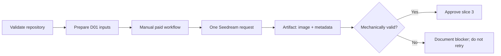

# Slice 2 specification: first live D01 baseline

**Summary:** Prove the baseline runner works end to end by executing exactly one paid Seedream generation for development case D01, inspecting the generated image and metadata, and recording whether the experiment is ready to expand to the model-comparison slice.

**Roadmap position:** Slice 2 of 7. Slice 1, the offline experiment foundation, is complete and merged.


```mermaid
flowchart LR
    A[Validate repository] --> B[Prepare D01 inputs]
    B --> C[Manual paid workflow]
    C --> D[One Seedream request]
    D --> E[Artifact: image + metadata]
    E --> F{Mechanically valid?}
    F -->|Yes| G[Approve slice 3]
    F -->|No| H[Document blocker; do not retry]
```

## 1. Goal

Produce the first real baseline artifact and answer one narrow question:

> Can the current runner send the intended model, environment, and garment references to Seedream, persist a usable result, and capture enough metadata for later comparison?

This slice validates experiment mechanics. It does not evaluate whether Seedream is the best model or whether the baseline prompt improves garment consistency.

## 2. Assignment alignment

The assignment prioritizes practical black-box experimentation, before/after evidence, garment-fidelity analysis, and honest cost and latency reporting. It explicitly does not reward production infrastructure or exhaustive benchmarking.

This slice therefore spends one controlled call to create evidence before expanding the experiment matrix. Automation exists only to make that controlled call repeatable and auditable.

## 3. Fixed D01 configuration

No D01 parameter may be tuned within this slice.

| Field | Required value |
| --- | --- |
| Case | `D01` |
| Split | `development` |
| Model reference | `inputs/models/black-bodysuit-woman.png` |
| Environment reference | `inputs/environments/street.png` |
| Garment reference | `inputs/garments/shorts.png` |
| Generator | `bytedance-seed/seedream-4.5` |
| Prompt | `prompts/baseline.txt` rendered for D01 |
| Strategy label | `baseline` |
| Candidate count | `1` |
| Aspect ratio | `3:4` |
| Resolution | `2K` |
| Automatic retries | `0` |
| Maximum D01 live requests | `1` |

The reference order remains model/person, environment, then garment packshot.

## 4. Permanent automation

The repository contains a permanent `.github/workflows/run-experiment.yml` workflow with two non-automatic entry points:

- `workflow_dispatch` for manual use in the GitHub Actions UI;
- `workflow_call` for an explicitly invoked reusable workflow.

The permanent workflow must never trigger directly from `push`, `pull_request`, or `schedule`.

Each invocation:

1. requires an explicit paid-run confirmation;
2. accepts only development cases `D01`, `D02`, or `D03` in this phase;
3. consumes `OPENROUTER_API_KEY` only from GitHub Actions secrets;
4. uses a per-case concurrency lock and does not cancel an in-progress paid run;
5. runs dependency sync, Ruff, strict mypy, pytest, and package build before spending;
6. prepares only the selected case from `asset_sources.json`;
7. calls `weon-eval` exactly once with the selected case and model;
8. uploads the selected case output as a 14-day workflow artifact.

Ordinary CI remains free and unchanged.

## 5. Preconditions

Before the D01 paid request:

1. the repository validation commands pass;
2. `asset_sources.json` contains the three D01 mappings;
3. `weon-prepare-inputs D01` downloads readable PNG files whose bytes match their suffixes;
4. the repository secret `OPENROUTER_API_KEY` is configured;
5. the workflow input is exactly `D01` with `bytedance-seed/seedream-4.5`;
6. paid-run confirmation is explicitly enabled;
7. no prior successful D01 baseline request has been made.

Failure of any precondition blocks the live call.

## 6. Execution

The permanent workflow ultimately executes these commands once:

```bash
uv run weon-prepare-inputs D01
uv run weon-eval D01 --model bytedance-seed/seedream-4.5
```

The slice must not introduce a loop, retry, additional candidate, additional case, or second model call.

### Failure policy

- A missing or invalid input blocks the paid request.
- An API error is recorded after secret sanitization.
- A failed live request ends slice 2 as `blocked`.
- Any retry is outside this slice and requires a separately approved follow-up after identifying the concrete failure.
- A visually poor but mechanically valid image counts as the baseline result and must not be regenerated in this slice.

Negative results are evidence, not a reason to resample.

## 7. Expected artifact

A successful workflow uploads:

```text
experiment-D01-<run-id>/
└── bytedance-seed_seedream-4.5/
    └── baseline/
        ├── image.png
        └── metadata.json
```

The underlying runner output remains Git-ignored. Input images and generated images are not committed.

`metadata.json` must contain:

- `case_id = "D01"`;
- `model = "bytedance-seed/seedream-4.5"`;
- `strategy = "baseline"`;
- the exact rendered prompt;
- the three ordered reference paths;
- API-reported `cost_usd`, or `null` when unavailable;
- measured `latency_seconds`.

The generated image must be non-empty and open successfully in a standard image viewer.

## 8. Manual inspection

Inspect the generated image against all three D01 references.

### Composition mechanics

- intended person present;
- street environment recognizably used;
- shorts present and worn rather than copied into the scene.

### Garment consistency

- color preservation;
- print or logo preservation when visible;
- overall silhouette and length;
- waistband, seams, closures, pockets, and other construction details;
- fabric appearance or texture;
- hallucinated or missing details.

Use one label for each applicable dimension: `preserved`, `partially preserved`, `drifted`, `not visible`, or `not applicable`.

This is a qualitative smoke inspection, not the final scoring rubric.

## 9. Committed execution record

Update `experiments/D01-baseline.md` with:

- UTC execution timestamp;
- exact command without secrets;
- workflow run identity and live request count;
- case, model, prompt path, and strategy;
- reported cost and measured latency;
- manual inspection labels with concise evidence;
- any API or rendering anomaly;
- final decision: `proceed to slice 3` or `blocked`.

Do not commit the API key, raw request headers, input images, generated output, or unrelated environment details.

## 10. Code-change policy

Allowed implementation changes are limited to:

- a small tested input-preparation command;
- the assignment source manifest;
- correction of source filename extensions to their actual image bytes;
- the permanent manual/reusable paid workflow;
- documentation and the experiment record.

Do not add capability discovery, balance preflight, retry orchestration, batch generation, automatic commits, or deployment infrastructure.

## 11. Non-goals

This slice does not:

- compare Seedream with Gemini;
- run D02, D03, H01, or H02;
- tune or rewrite the baseline prompt;
- add structured garment attributes;
- implement VLM scoring;
- generate best-of-two candidates;
- define the final evaluation rubric;
- rerun because the output is aesthetically weak or garment fidelity is poor.

## 12. Definition of done

Slice 2 is complete only when:

1. dependency sync, Ruff, strict mypy, tests, and build pass;
2. the permanent paid workflow has no automatic event trigger;
3. exactly one D01 live request has been sent;
4. no other case has been executed;
5. the generated image opens successfully;
6. metadata contains the exact experiment identity, ordered references, cost field, and latency;
7. D01 is manually inspected against the source references;
8. `experiments/D01-baseline.md` records the evidence and decision;
9. the temporary one-time trigger is removed;
10. the PR documents the system flow and result without exposing secrets.

### Decision gate

Proceed to slice 3 only when the request is mechanically valid and the saved artifacts are sufficient for a fair Seedream-versus-Gemini comparison.

A garment-fidelity failure does not block slice 3; it is the baseline evidence that slice 3 and later improvement strategies are meant to address.
